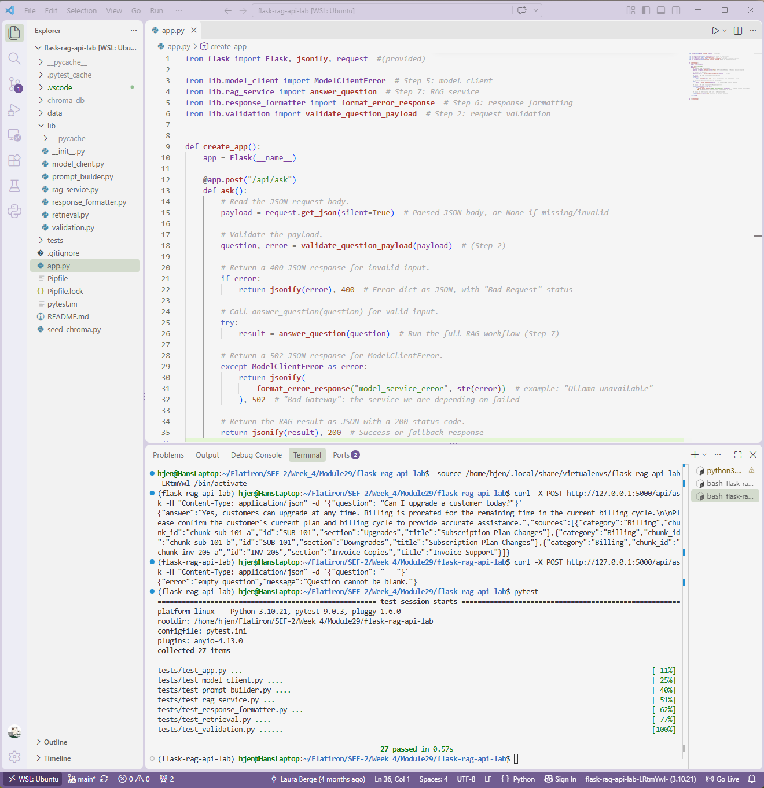

# Lab: Build a Flask RAG API Endpoint
**Completed Sept 29, 2026**

## Overview
A Flask API that answers customer success questions using **Retrieval-Augmented Generation (RAG)**. It retrieves relevant policy text from a Chroma vector database, asks a local Ollama model to answer using only that text, and returns the answer along with the sources it came from.
 

 
## How It Works
 
Every request to `POST /api/ask` runs through the same pipeline:
 
```
question → validate → retrieve context → (fallback if none) → build prompt → call model → format answer and sources
```
 
Each stage lives in its own module, so it can be tested and changed on its own:
 
| Module | Responsibility |
|---|---|
| `app.py` | Flask route: reads the request, validates it, and maps results to HTTP status codes |
| `lib/validation.py` | Rejects missing, non-string, blank, or too-short questions before any other work runs |
| `lib/retrieval.py` | Queries Chroma and normalizes its nested results into flat context chunks |
| `lib/prompt_builder.py` | Builds a structured prompt that restricts the model to the approved context |
| `lib/model_client.py` | Sends the prompt to Ollama and converts every failure into a `ModelClientError` |
| `lib/response_formatter.py` | Builds success, fallback, and error response bodies |
| `lib/rag_service.py` | Runs the pipeline in order, with injectable dependencies for testing |
 
## API
 
### `POST /api/ask`
 
**Request**
 
```json
{ "question": "Can I upgrade a customer today?" }
```
 
**Success (200)**: an answer grounded in the retrieved policy documents, plus source metadata for review.
 
```json
{
  "answer": "Yes, customers can upgrade at any time...",
  "sources": [
    {
      "id": "SUB-101",
      "title": "Subscription Plan Changes",
      "category": "Billing",
      "section": "Upgrades",
      "chunk_id": "chunk-sub-101-a"
    }
  ]
}
```
 
**Fallback (200)**: when no approved context is found, the model is never called, and the API returns a safe message with no sources.
 
```json
{
  "answer": "The approved customer success documents do not contain enough information to answer that question...",
  "sources": []
}
```
 
**Invalid input (400)**: one of `invalid_request`, `missing_question`, `invalid_question`, `empty_question`, or `short_question`.
 
```json
{ "error": "empty_question", "message": "Question cannot be blank." }
```
 
**Model service failure (502)**: Ollama is unreachable or returned an unusable response.
 
```json
{ "error": "model_service_error", "message": "Model request failed: ..." }
```
 
## Design Decisions
 
- **Grounding:** The prompt tells the model to use only the approved context, not to invent rules, dates, prices, or exceptions, and to say when information is missing.
- **Fallback before generation:** If retrieval returns nothing, the service returns the fallback response without calling the model, so it has no chance to make up a policy.
- **Source attribution without data exposure:** Sources include document and chunk IDs for review, but not full chunk text or distance scores.
- **One error type for the model:** Network failures, bad JSON, and blank answers all become `ModelClientError`, so the route handles every model problem with a single `except` and a 502.
- **Dependency injection:** `answer_question()` and `retrieve_context()` accept optional fakes, so the full workflow is tested without a real database or model.

## Setup
 
Requires Python 3.10 and `pipenv`.
 
```
pipenv install
pipenv shell
```
 
## Running The Tests
 
```
pytest -q
```
 
The tests mock Chroma and the model, so they don't need Ollama or internet access.
 
## Tryin It Locally (optional)
 
This requires [Ollama](https://ollama.com) installed and running.
 
1. Download the model:
```
   ollama pull llama3.2
```
 
2. Load the knowledge base into Chroma. This creates a local `chroma_db/` folder, which is git-ignored.
```
   python seed_chroma.py
```
 
3. Start the API:
```
   flask run
```
 
4. In a second terminal, ask a question:
```
   curl -X POST http://127.0.0.1:5000/api/ask \
     -H "Content-Type: application/json" \
     -d '{"question": "Can I upgrade a customer today?"}'
```
 
Chroma may print `Failed to send telemetry event` warnings. They come from Chroma's anonymous usage reporting and can be safely ignored.
 
## Technology Used
Python 3.10 · Flask · ChromaDB · Ollama (llama3.2) · requests · pytest
 